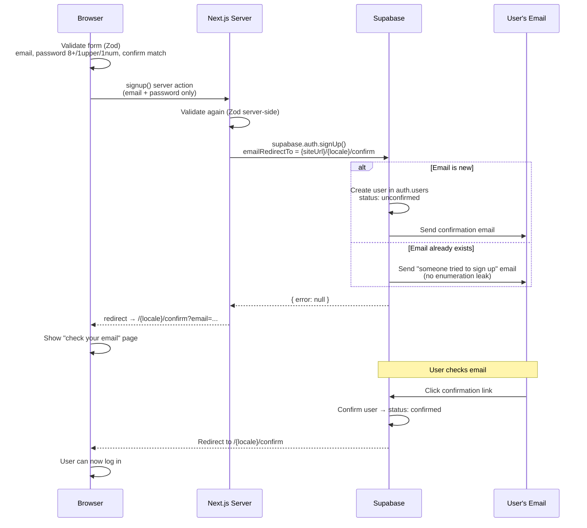
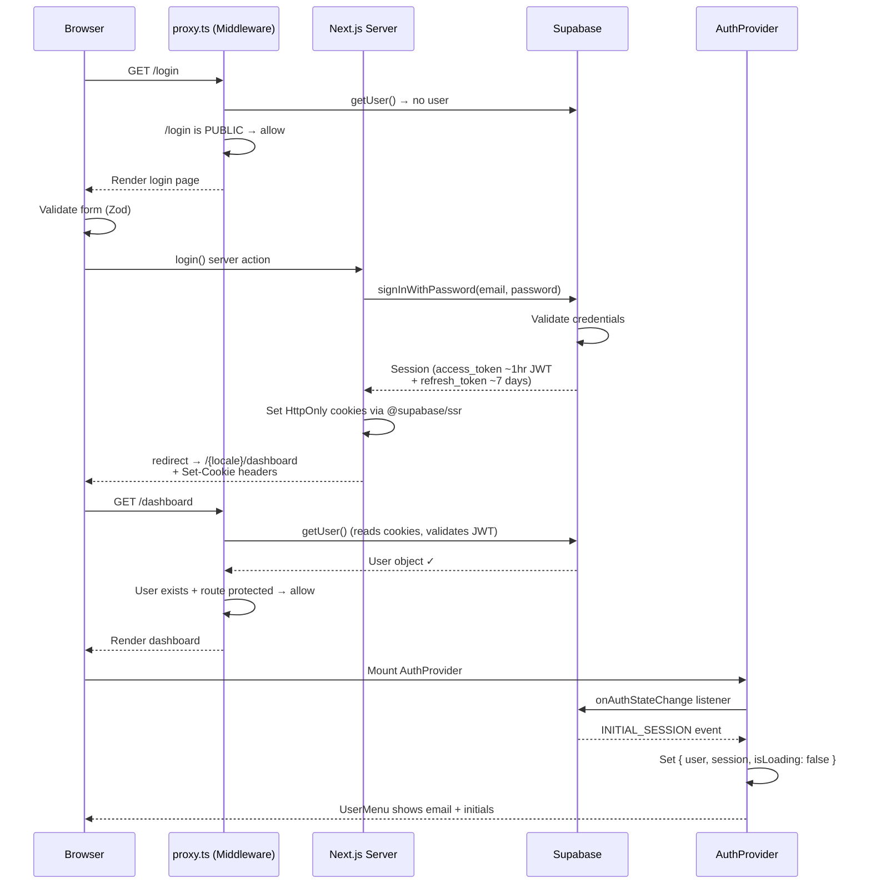
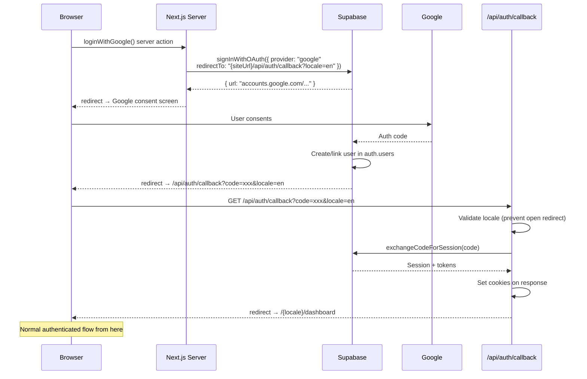
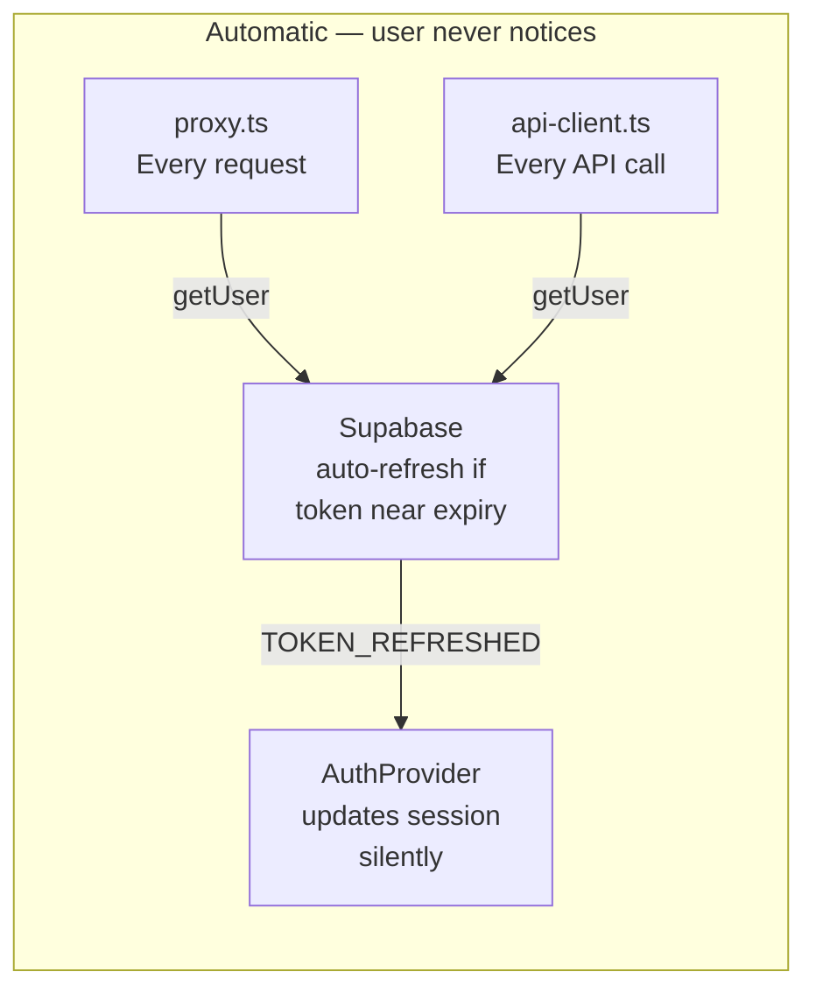
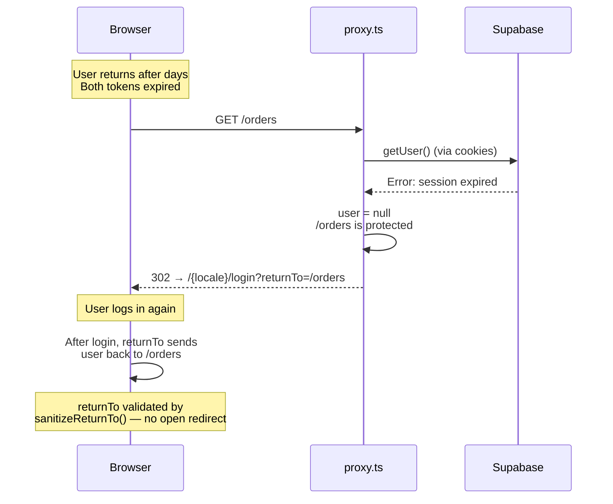

# Auth Flows

> Diagrams use [Mermaid](https://mermaid.js.org/) syntax — renders natively on GitHub, Linear, Notion, and most markdown viewers.

---

## 1. Signup (Email/Password)

**Security:** Always returns `{ error: null }` even if email exists — prevents enumeration.

---

## 2. Login (Email/Password)

**Security:** Returns opaque `"invalidCredentials"` — doesn't distinguish invalid password vs unconfirmed email.

---

## 3. Google OAuth

---

## 4. Authenticated API Call

```mermaid
sequenceDiagram
    participant C as Component
    participant AC as api-client.ts
    participant SB as Supabase
    participant API as NestJS API
    participant DB as Tenant DB

    C->>AC: apiClient("/settings")

    rect rgb(40, 40, 60)
        Note over AC,SB: getAccessToken()
        AC->>SB: getUser() (server round-trip via cookies)
        SB->>SB: Validate JWT, auto-refresh if needed
        SB-->>AC: User ✓
        AC->>SB: getSession() (local cache)
        SB-->>AC: access_token
    end

    AC->>API: fetch(API_URL/settings)<br/>Authorization: Bearer <token>
    API->>SB: Validate JWT against JWKS
    SB-->>API: Valid ✓
    API->>API: Extract tenant_id from JWT claims
    API->>DB: Connect to tenant DB, query
    DB-->>API: Settings data
    API-->>AC: { data: settings }
    AC-->>C: Settings data
```

---

## 5. Token Refresh (Transparent)

Three refresh points ensure tokens stay fresh:
- **proxy.ts** — every page navigation
- **api-client.ts** — every API call
- **AuthProvider** — `onAuthStateChange(TOKEN_REFRESHED)` updates React state

---

## 6. 401 Retry (API Returns Unauthorized)

```mermaid
flowchart TD
    A[api-client: fetch request] --> B{Response?}
    B -->|200 OK| C[Return data ✓]
    B -->|401| D[revalidateSession]
    B -->|Other error| E[Throw ApiError]

    D --> F{Got fresh token?}
    F -->|Yes| G[Retry request once<br/>with new token]
    F -->|No session| H[Throw ApiError 401]

    G --> I{Retry response?}
    I -->|200 OK| C
    I -->|Still 401| H

    H --> J[AuthProvider SIGNED_OUT<br/>event handles redirect]

    style D fill:#4a3f6b,stroke:#7c3aed
    style G fill:#1a4a3f,stroke:#14b8a6
    style H fill:#4a1a1a,stroke:#ef4444
```

**Concurrency protection:** Module-level promise lock ensures multiple simultaneous 401s share a single `revalidateSession()` call.

---

## 7. Session Expiry (Refresh Token Expired)

---

## 8. Logout

```mermaid
sequenceDiagram
    participant U as UserMenu
    participant AP as AuthProvider
    participant SB as Supabase
    participant TQ as TanStack Query
    participant R as Router

    U->>AP: signOut()

    rect rgb(40, 40, 60)
        Note over AP,R: try block — if any step fails, log + stop
        AP->>SB: supabase.auth.signOut()
        SB->>SB: Revoke refresh token<br/>Clear cookies
        SB-->>AP: Success ✓

        AP->>TQ: queryClient.clear()
        TQ->>TQ: Wipe all cached data<br/>(prevents data leakage<br/>between users)

        AP->>R: router.push(/{locale}/login)
    end

    SB-->>AP: onAuthStateChange: SIGNED_OUT
    AP->>AP: Set { user: null, session: null }
```

**Error handling:** If `signOut()` throws (network error), logs to console, does NOT redirect — user stays on current page and can retry.

---

## Quick Reference

| Flow | Trigger | Happy path | Failure path |
|------|---------|-----------|--------------|
| Signup | User submits form | Confirm email → login | Opaque error (no leak) |
| Login | User submits form | Set cookies → dashboard | `"invalidCredentials"` |
| Google OAuth | Click Google button | Consent → callback → dashboard | Redirect to login |
| API Call | Component fetches | Bearer token → data | ApiError thrown |
| Token Refresh | Auto (3 checkpoints) | Transparent rotation | Falls to 401 retry |
| 401 Retry | API returns 401 | Revalidate → retry once | Throw → SIGNED_OUT redirect |
| Session Expiry | Both tokens dead | proxy.ts → login + returnTo | N/A (this IS the failure) |
| Logout | User clicks button | signOut → clear cache → login | Log error, stay on page |

---

## Source Files

| File | What it does |
|------|-------------|
| `src/proxy.ts` | Route protection + session refresh middleware |
| `src/lib/supabase/browser.ts` | Singleton Supabase client (browser) |
| `src/lib/supabase/server.ts` | Per-request Supabase client (server) |
| `src/lib/supabase/middleware.ts` | Supabase client for proxy.ts |
| `src/lib/api-client.ts` | Fetch wrapper: auth headers, 401 retry |
| `src/lib/auth/actions.ts` | Server actions: login, signup, OAuth, forgot |
| `src/lib/auth/validation.ts` | Zod schemas for auth forms |
| `src/lib/auth/route-config.ts` | PUBLIC_ROUTES, sanitizeReturnTo |
| `src/components/providers/auth-provider.tsx` | AuthProvider + useAuth() hook |
| `src/components/shell/user-menu.tsx` | User menu with real auth + signOut |
| `src/app/api/auth/callback/route.ts` | OAuth code → session exchange |
